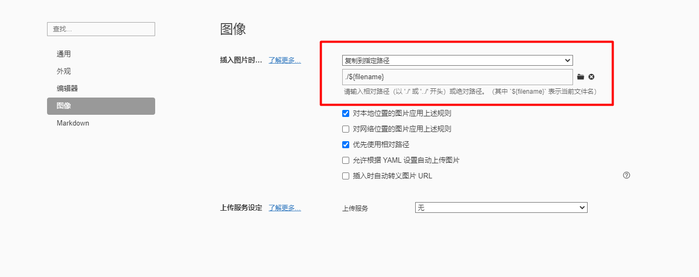

# Typora+PicGo+gitee

首先安装node.js

下载：

https://nodejs.org/en/

添加环境变量：

```
NODE_HOME
D:\nodejs
```

```
%NODE_HOME%
%NODE_HOME%\node-global
```


在插件设置里面安装gitee-uploader


only:  c5ffb43c5ee20eefeb617e49116fe506

github: 567ab893d0e01202ca4f740db36ccaa69d6b7d88


**方式2：**

直接复制到制定路径

