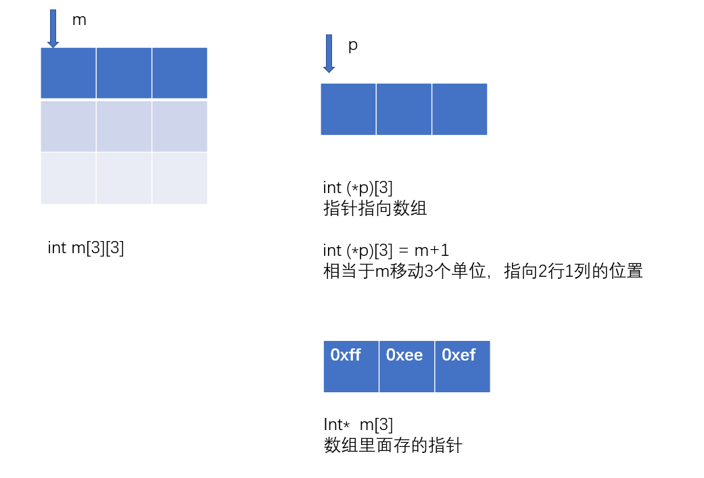

## 指针和数组的关系

### 1.双指针

指向指针的指针

### 2.指针数组

是一个数组，数组里面存放的指针        int*    array[]

**int* p[3];   有3行**

### 3.数组指针

是一个指针，指针指向一个数组      int    (*Pointer) []

**int （*p）[3]  有3列**


```
int m[3][3];   3x3的二维数组
int (*p)[3] = m+1;   
```




int *p = new int[10]   动态整型数组 长度为10    相当于int p[10]

int *p = new int(10)   初始化，p指向一个值为10的int数

new int[] []

int * * p  = new int*[n]   二维数组   int *p = new int[m]  int p[n] [m]

  


